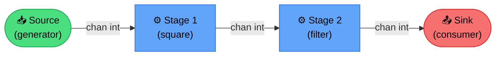
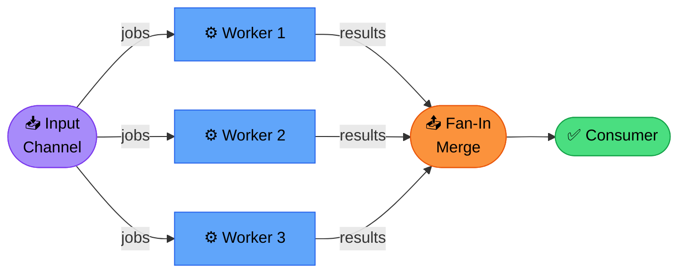
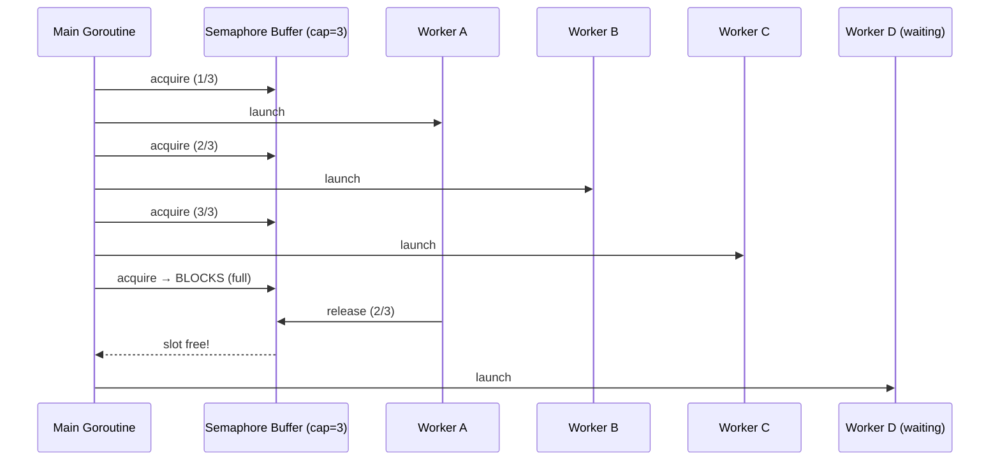
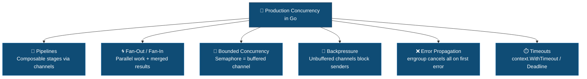

Basic goroutines and channels are easy. Building production-grade concurrent systems that handle backpressure, partial failures, and resource limits is hard.

This article covers advanced patterns used in high-performance Go services: pipelines, fan-out/fan-in, bounded concurrency, and error propagation.

## Why basic patterns aren't enough

Most Go tutorials show unbounded concurrency:

```go
for _, item := range items {
    go process(item) // spawns N goroutines
}
```

This works for demos. In production:

- **Memory explosion**: 1M items = 1M goroutines = OOM
- **No backpressure**: downstream can't signal "slow down"
- **Error handling**: one failure doesn't stop the rest
- **Shutdown**: no way to cancel in-flight work

Senior engineers need patterns that scale under load and degrade gracefully.

## Pattern 1: Pipeline with stages

A pipeline is a series of stages connected by channels. Each stage:

- Receives values from upstream via inbound channel
- Performs computation
- Sends results downstream via outbound channel



### Basic pipeline structure

```go
func generator(ctx context.Context, nums ...int) <-chan int {
    out := make(chan int)
    go func() {
        defer close(out)
        for _, n := range nums {
            select {
            case out <- n:
            case <-ctx.Done():
                return
            }
        }
    }()
    return out
}

func square(ctx context.Context, in <-chan int) <-chan int {
    out := make(chan int)
    go func() {
        defer close(out)
        for n := range in {
            select {
            case out <- n * n:
            case <-ctx.Done():
                return
            }
        }
    }()
    return out
}

func main() {
    ctx, cancel := context.WithCancel(context.Background())
    defer cancel()

    in := generator(ctx, 1, 2, 3, 4)
    out := square(ctx, in)

    for result := range out {
        fmt.Println(result)
    }
}
```

### Key principles

- Each stage owns its output channel and closes it when done
- Use `select` with `ctx.Done()` for cancellation
- Closing upstream channel signals "no more data" to downstream

## Pattern 2: Fan-out / Fan-in

**Fan-out**: distribute work from one channel to multiple workers.

**Fan-in**: merge results from multiple workers into one channel.



### Fan-out with bounded workers

```go
func fanOut(ctx context.Context, in <-chan Job, workers int) []<-chan Result {
    channels := make([]<-chan Result, workers)
    for i := 0; i < workers; i++ {
        channels[i] = worker(ctx, in)
    }
    return channels
}

func worker(ctx context.Context, jobs <-chan Job) <-chan Result {
    out := make(chan Result)
    go func() {
        defer close(out)
        for job := range jobs {
            select {
            case out <- process(job):
            case <-ctx.Done():
                return
            }
        }
    }()
    return out
}
```

### Fan-in: merge multiple channels

```go
func fanIn(ctx context.Context, channels ...<-chan Result) <-chan Result {
    out := make(chan Result)
    var wg sync.WaitGroup

    multiplex := func(c <-chan Result) {
        defer wg.Done()
        for result := range c {
            select {
            case out <- result:
            case <-ctx.Done():
                return
            }
        }
    }

    wg.Add(len(channels))
    for _, c := range channels {
        go multiplex(c)
    }

    go func() {
        wg.Wait()
        close(out)
    }()

    return out
}
```

### Complete fan-out/fan-in example

```go
func processPipeline(ctx context.Context, jobs []Job) <-chan Result {
    // Stage 1: feed jobs
    jobChan := generator(ctx, jobs)

    // Stage 2: fan-out to N workers
    workerOutputs := fanOut(ctx, jobChan, 10)

    // Stage 3: fan-in results
    return fanIn(ctx, workerOutputs...)
}
```

## Pattern 3: Bounded concurrency with semaphore

Limit concurrent operations using a buffered channel as semaphore:



```go
func processWithLimit(ctx context.Context, items []Item, limit int) []Result {
    sem := make(chan struct{}, limit)
    results := make([]Result, len(items))
    var wg sync.WaitGroup

    for i, item := range items {
        wg.Add(1)
        go func(idx int, it Item) {
            defer wg.Done()

            // acquire
            select {
            case sem <- struct{}{}:
            case <-ctx.Done():
                return
            }
            defer func() { <-sem }() // release

            results[idx] = process(it)
        }(i, item)
    }

    wg.Wait()
    return results
}
```

This pattern guarantees max `limit` goroutines run concurrently, preventing resource exhaustion.

## Pattern 4: Error propagation with errgroup

Use `golang.org/x/sync/errgroup` for coordinated error handling:

```go
import "golang.org/x/sync/errgroup"

func fetchAll(ctx context.Context, urls []string) error {
    g, ctx := errgroup.WithContext(ctx)

    for _, url := range urls {
        url := url // capture loop var
        g.Go(func() error {
            return fetch(ctx, url)
        })
    }

    // Wait blocks until all goroutines finish
    // Returns first non-nil error (if any)
    return g.Wait()
}
```

**Key behavior:**

- First error cancels the context
- All goroutines receive cancellation signal
- `Wait()` returns first error encountered

### Bounded errgroup

Limit concurrency with `SetLimit`:

```go
g, ctx := errgroup.WithContext(ctx)
g.SetLimit(10) // max 10 concurrent goroutines

for _, item := range items {
    item := item
    g.Go(func() error {
        return process(ctx, item)
    })
}

return g.Wait()
```

## Pattern 5: Backpressure with buffered channels

Unbuffered channels create natural backpressure: sender blocks until receiver is ready.

Buffered channels add elasticity but can hide overload:

```go
// Unbuffered: strict backpressure
jobs := make(chan Job)

// Buffered: absorbs bursts
jobs := make(chan Job, 100)
```

### When to buffer

- **Small buffer (10-100)**: smooth out micro-bursts
- **Large buffer (1000+)**: risk hiding systemic overload
- **Unbuffered**: strictest backpressure, highest latency variance

### Monitoring queue depth

```go
func monitorQueue(jobs chan Job) {
    ticker := time.NewTicker(5 * time.Second)
    defer ticker.Stop()

    for range ticker.C {
        depth := len(jobs)
        queueDepthGauge.Set(float64(depth))

        if depth > cap(jobs)*80/100 {
            log.Warn("queue near capacity", "depth", depth)
        }
    }
}
```

## Pattern 6: Timeout and deadline enforcement

### Per-operation timeout

```go
func fetchWithTimeout(url string, timeout time.Duration) ([]byte, error) {
    ctx, cancel := context.WithTimeout(context.Background(), timeout)
    defer cancel()

    req, _ := http.NewRequestWithContext(ctx, "GET", url, nil)
    resp, err := http.DefaultClient.Do(req)
    if err != nil {
        return nil, err
    }
    defer resp.Body.Close()

    return io.ReadAll(resp.Body)
}
```

### Pipeline-wide deadline

```go
func processBatch(items []Item, deadline time.Time) ([]Result, error) {
    ctx, cancel := context.WithDeadline(context.Background(), deadline)
    defer cancel()

    return runPipeline(ctx, items)
}
```

## Real-world example: high-throughput data processor

```go
type Processor struct {
    workers   int
    batchSize int
}

func (p *Processor) Process(ctx context.Context, input <-chan Record) <-chan Result {
    // Stage 1: batch records
    batches := p.batcher(ctx, input)

    // Stage 2: fan-out processing
    workerOutputs := make([]<-chan Result, p.workers)
    for i := 0; i < p.workers; i++ {
        workerOutputs[i] = p.worker(ctx, batches)
    }

    // Stage 3: fan-in results
    return p.merge(ctx, workerOutputs...)
}

func (p *Processor) batcher(ctx context.Context, in <-chan Record) <-chan []Record {
    out := make(chan []Record)
    go func() {
        defer close(out)
        batch := make([]Record, 0, p.batchSize)

        for {
            select {
            case r, ok := <-in:
                if !ok {
                    if len(batch) > 0 {
                        out <- batch
                    }
                    return
                }
                batch = append(batch, r)
                if len(batch) >= p.batchSize {
                    out <- batch
                    batch = make([]Record, 0, p.batchSize)
                }
            case <-ctx.Done():
                return
            }
        }
    }()
    return out
}

func (p *Processor) worker(ctx context.Context, batches <-chan []Record) <-chan Result {
    out := make(chan Result)
    go func() {
        defer close(out)
        for batch := range batches {
            result := processBatch(batch)
            select {
            case out <- result:
            case <-ctx.Done():
                return
            }
        }
    }()
    return out
}

func (p *Processor) merge(ctx context.Context, channels ...<-chan Result) <-chan Result {
    out := make(chan Result)
    var wg sync.WaitGroup

    wg.Add(len(channels))
    for _, c := range channels {
        go func(ch <-chan Result) {
            defer wg.Done()
            for r := range ch {
                select {
                case out <- r:
                case <-ctx.Done():
                    return
                }
            }
        }(c)
    }

    go func() {
        wg.Wait()
        close(out)
    }()

    return out
}
```

## Performance considerations

### Benchmark different worker counts

```go
func BenchmarkPipeline(b *testing.B) {
    for _, workers := range []int{1, 2, 4, 8, 16} {
        b.Run(fmt.Sprintf("workers=%d", workers), func(b *testing.B) {
            // benchmark with N workers
        })
    }
}
```

### Profile with pprof

```bash
go test -bench=. -cpuprofile=cpu.out
go tool pprof cpu.out
```

Look for:

- Excessive channel operations
- Lock contention in fan-in
- Goroutine scheduling overhead

## Key takeaways



- **Pipelines** structure concurrent work into composable stages
- **Fan-out/fan-in** parallelizes work while maintaining order and error handling
- **Bounded concurrency** prevents resource exhaustion under load
- **Backpressure** via unbuffered or small-buffered channels keeps system stable
- **Context cancellation** enables graceful shutdown and timeout enforcement
- **errgroup** simplifies coordinated error handling across goroutines
- Always benchmark and profile to find optimal worker count for your workload
