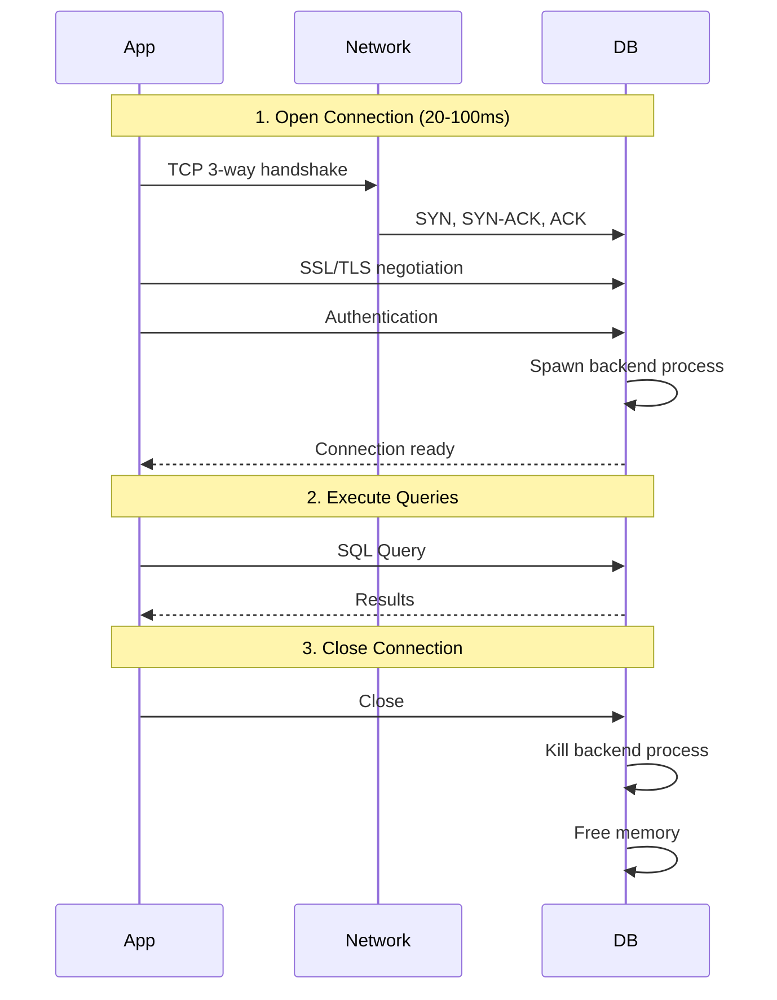
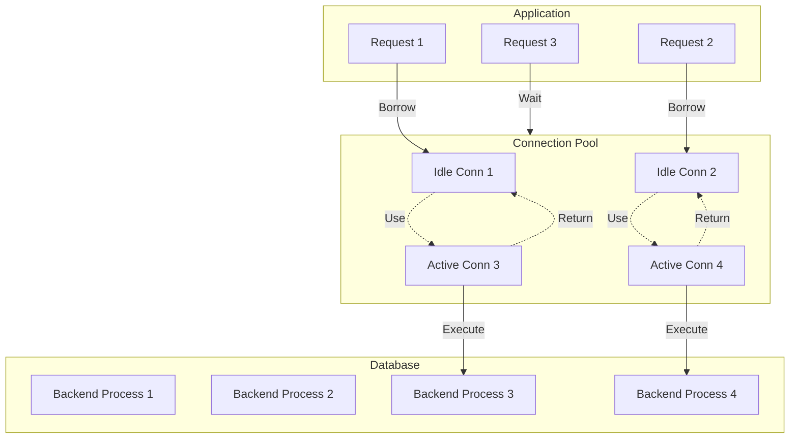

## Table of contents

## What is Connection?

Before we talk about connection pooling, we need to understand what a "connection" actually is and why it matters.

When your application wants to talk to database, it can't shoot just a query into thin air. It needs to establish a connection.

It's a dedicated communication channel between your application and database server.

Once connection established, it let you send SQL query and receive results back.

## What happens inside PostgreSQL when a connection opens

PostgreSQL and most DBs uses process-per-connection model. Everytime client connects, PostgreSQL forks a new OS process dedicated to serving that client. This is known as postmaster spawning backend process.

Each backend process:
- Allocate its own memory (typically 5-10 MB per connection)
- Maintans an authentication session
- Has its own transactions state and buffer cache

This is why connections are expensive. It's not just a socket - its OS process with real memory.

PostgreSQL has hard limit of simultaneous connections, configured by `max_connections` in config file. The default is typically 100.

## Lifecycle of Connection



**Open the connection** (takes 20-100 ms depending on network latency)
- TCP 3 way handshake
- SSL/TLS Negotiation(if enabled)
- authentication (username + password)
- backend process spawning

**Execute SQL Statement**
- send queries
- receive results

**Close the connection**
- backend process killed
- memory freed
- socket closed

If your app opens and closes fresh connection every query you executes, the overhead of steps 1 and 3 can easily affect the query execution time. A query that takes 2ms cost way more just because of opening and closing connection.

## How long it takes to opening a connection?

Below are rough reference points:

**If you are on same data center, same rack.**
It take 1-5ms

**If you are on same data center, but different rack.**
It take 5-20ms

**If you are in different data cener.**
It take 50-200ms

**If you are cross region.**
It take 800-1500ms

## Solution: Connection Pooling

A connection pool is a cache of pre-established database connections that can be reused, rather than opened and closed on every request.

Idea is simple: instead of creating new connection every time, application borrows a connection from the pool, uses it, and returns it when done. Pool manages set of long lived connections.

**Active connections** are those which currently executing your query.

**Idle connections** are waiting for incoming query execution.

Idle connections are not there for free, it blocks 10-30MB of your memory to keep it opened.

## How a Pool works



**Initialisation:** When your app starts, the pool opens a minimum number of connections (e.g. 3 or 5) to the database and keep them alive in a queue.

**Borrow:** A request arrives and asks the pool for a connection. If one is idle, it's immediately handed over.

**Use:** Request runs its queries on that connection. Other requests needing connection either get a different idle one or wait in queue.

**Return:** When request finishes, it returns the connection to the pool. The connection is NOT closed. It's reset and made available for next request.

**Health Checks:** The pool periodically checks that idle connections are still alive and replaces any that have gone stale or been killed by db.

```javascript
const { Pool } = require("pg");

const pool = new Pool({
  host: "localhost",
  database: "myapp",
  min: 2, // always keep 2 connections alive
  max: 10, // never open more than 10 at once
  idleTimeoutMillis: 30000, // close idle conns after 30s
  connectionTimeoutMillis: 2000, // fail fast if pool is exhausted
});

async function getUser(id) {
  // borrows a connection, runs query, returns it automatically
  const res = await pool.query("SELECT * FROM users WHERE id = $1", [id]);
  return res.rows[0];
}

// Connection is returned to the pool the moment pool.query() resolves.
```

## Application Side Connection Pool

It lives inside application process

Gets more flexibility as it tailored to specific need of application

E.g. `pg.Pool` in Node.js, `HikariCP` in Java

## Database Side Connection Pool

Standalone proxy process sit between your application and Postgres.

Database server controls pool, offer less customization

E.g. `PgBouncer` from PostgreSQL

## What happens when all connections are busy?

If every connection in the pool is in use and a new request comes in, the pool puts that request in a waiting queue.

The request will be served as soon as a connection is returned. If the wait exceeds `connectionTimeoutMillis`, the pool throws an error — which is the right behavior, because it prevents silent, unbounded queue growth that would cause memory exhaustion.

A pool that is constantly at maximum capacity with a growing wait queue is signal that your pool size is too small or your queries taking too long. Don't blindly increase the pool size; that can make things worse.

## Little's Law - the math behind queuing

Connection pooling is not just a software pattern. It is backed by powerful mathematical principle from queuing theory called Little's Law.

```
L = λ × W
```

Here,
- **L** = average number of requests in the system (being served + waiting)
- **λ** = average arrival rate of requests (requests per second)
- **W** = average time a request spends time in the system (service time)

**Example:**

app receives 50 requests per second & each requests hold a DB connection for an average of 20 ms(0.02s)

```
L = 50 req/s * 0.02s = 1 connection
```

At any moment only one connection is needed on average.

But, what if slow query spikes service time to 200ms?

```
L = 50 req/s * 0.2s = 10 connections
```

Now you need 10 concurrent connection to keep up.

This reveals a critical insight: **query latency directly drives connection demand.**

Slow queries are not just user experience problems. They are infrastructure scaling problems as well. Optimizing your query reduce the number of connections you need.

Maximum sustainable request rate your pool can handle is:

```
max_throughput = pool_size / avg_service_time
```

For example, if you have 10 connections where each query takes 10ms can handle 1000 requests per second. Beyond that, requests queue up.

## Kingman's Formula - why 100% utilisation is dangerous

Even if your pool has enough connections on average, you can still see large queues and high latency. This is explained by Kingman's Formula.

Kingman's formula says that queue length grows non-linearly (exponentially) as utilisation approaches 100%.

**Never run your connection pool above ~70-80% utilisation**

Once you cross that threshold, even small bursts in traffic cause disproportionately long queues. This is true for any shared resources:
- CPU Cores
- Network Bandwidth or
- Database Connections

This is why the recommended first action when you see connection pool exhaustion is not increase the pool size. It's to reduce the query latency first.

## Process to Core Ratio - sizing your pool

So how big your pool should be? THis is one of the most practical questions in backend engineering, and the answer comes from how databases actually execute queries.

A database can only run as many queries in parallel as it has CPU cores. Having more connections than cores doesn't make your DB faster. It makes it slower, because the OS has to context switch between processes and each processes waste time waiting for CPU.

```
pool_size = (core_count * 2) + effective_spindle_count
```

where, `effective_spindle_count` is the number of disk spindles(hard drive) the DB is using. For SSDs or managed cloud DBs(e.g. RDS or Supabase), treat this as 1.

**Example:** Database server with 4 CPU Cores and SSD Storage

```
pool_size = (4 * 2) + 1 = 9 connections
```

This often surprises us. Only 9 connections for 500 concurrent users? Yes, because those 9 connections are serving queries in parallel at CPU speed and users mostly wait for I/O, not CPU.

You don't need more connections; you need connections to be efficient.

## Uber/Postgres Lesson

Uber famously documented that reducing their connection count(via PgBouncer) and query optimisation improved throughput more than increasing connections did. A smaller, busy pool outperforms a large, context switching one.

## Application Instances

Pool size also depends on your application.

You also need to account how many application instances(server processes) are connecting to the same database:

```
total_connections = pool_size * num_app_instances
```

If you have 10 app server instances each with a pool size of 20, you are opening 200 connections. If you have Postgres `max_connections` is 100, some of those connections will be refused.

## Key Takeaways

**Database connection is a real OS process**
It's not lightweight object. Opening one costs 20-100ms and 5-10MB of RAM.

**Always use a connection pool in production**
Raw connections don't scale. A pool amortises setup costs across many queries.

**Pool size is not "bigger the better"**
The right size is `(cores * 2) + spindles`. More connections than cores causes context-switch overhead.

**Little's Law links query speed to connection demand**
Slow queries consume connections longer, meaning you need more of them. Optimize your queries first.

**Never run above 70-80% pool utilisation**
Kingman's formula shows that latency explodes non-linearly above this threshold. Even a small burst causes a larger queue spike.

**Account for multiple app instances**
Total DB Connections = `pool_size * num_app_instances`. Ensures this number is under `max_connections` or use a proxy like PgBouncer.

**For serverless, use a connection proxy**
Functions that cold-start constantly must not open direct connections. PgBouncer or cloud native solutions (RDS Proxy, Supabase Pooler) are essential.

---

Hope you found this helpful. Share it with your peers and colleagues so it can help more people.
