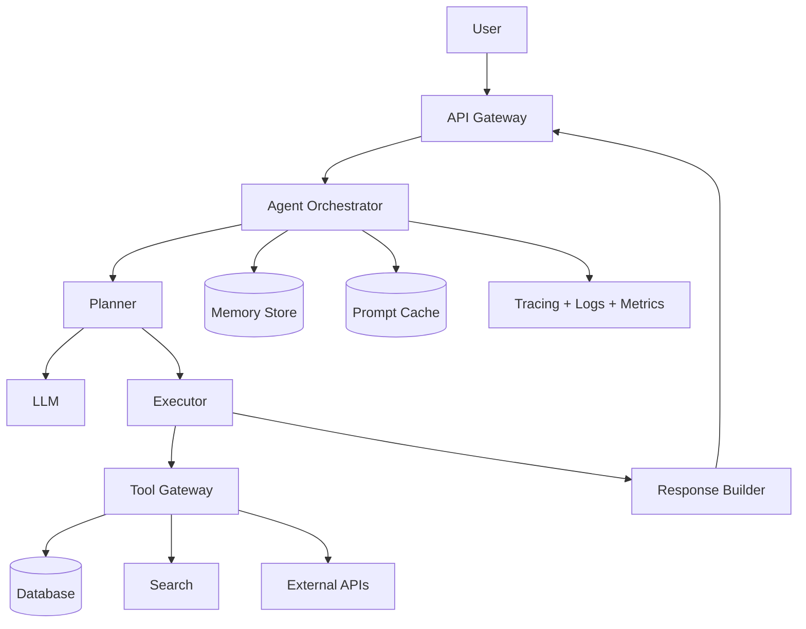
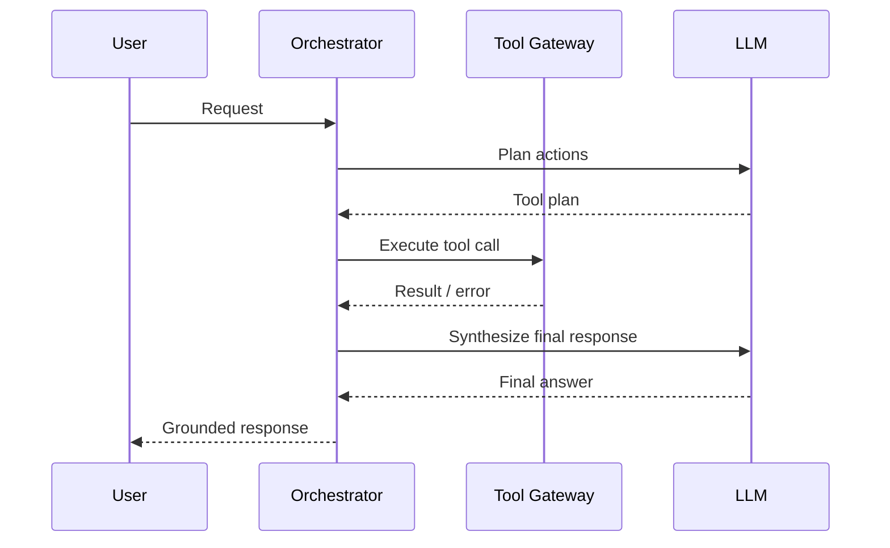

AI agents in production require much more than calling an LLM. You need reliable orchestration, strict security boundaries, clear observability, and predictable cost.

## 1) Problem Statement
Build an AI agent that can:
- Handle multi-turn user conversations
- Select and call tools (DB/search/external APIs)
- Return grounded answers with evidence
- Stay reliable under failures and high traffic
- Enforce security and budget limits

## 2) Requirements
### Functional
- Multi-turn context management
- Planner/executor loop for tool use
- Structured tool input/output validation
- Retry/fallback on tool failures
- Evidence-based responses

### Non-functional
- P95 latency under target SLA
- Token and tool-call budget per request
- Full audit trail for every action
- Role-based tool authorization
- Horizontal scalability

## 3) Proposed Architecture

## 4) Core Components
### Orchestrator (Planner + Executor)
- **Planner** decides next steps and required tools.
- **Executor** runs tool calls safely and returns results.
- The loop continues until completion or budget limit.

### Tool Gateway
- Central policy enforcement point
- Input schema validation
- Timeouts, retries, circuit breakers
- Per-tool rate limiting

### Memory Strategy
- **Short-term memory**: current session context
- **Long-term memory**: durable user preferences/profile
- Context compaction/summarization to avoid token bloat

## 5) Reliability and Failure Handling
- Tool timeout → retry with backoff, then fallback
- Provider failure → multi-provider fallback path
- Partial failure → graceful degradation with explicit messaging
- Prompt injection attempts → strict tool sandboxing + parameter filtering

## 6) Cost Control
- Token budgets per request/session
- Max tool calls and timeout limits
- Prompt caching for static prefixes
- Model routing (small model for simple tasks)

## 7) Observability
Track:
- End-to-end latency and per-stage latency
- Tool success/failure/timeout rates
- Token usage and cost per request
- Error rates by tenant/tool/model

## 8) Trade-offs
| Option | Advantage | Cost |
|---|---|---|
| Free-form agent behavior | Flexible for complex tasks | Harder to predict/debug |
| Rule-heavy orchestration | Predictable and safer | Less flexible |
| Aggressive retries | Better success rate | Higher latency/cost |

## 9) Production Checklist
- [ ] Tool ACL by role
- [ ] Schema validation for tool I/O
- [ ] Retry/backoff/circuit breakers
- [ ] Prompt injection guardrails
- [ ] Token budget enforcement
- [ ] Trace + log + metric dashboards
- [ ] Cost and error alerts

## Conclusion
A production AI agent is a distributed system problem, not just an LLM prompt problem. The winning design balances **intelligence, control, reliability, and cost**.