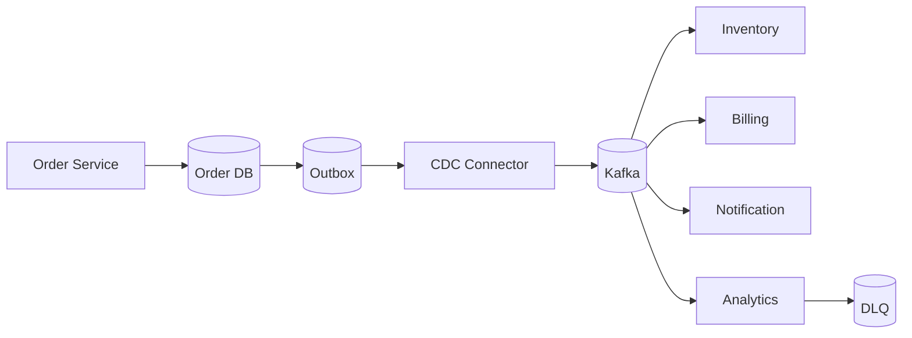
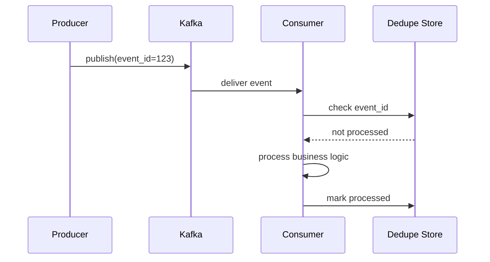

Event-driven architecture reduces coupling between services, but poor design creates systems that are hard to debug and inconsistent.

## 1) Problem Statement
Transition from monolith/sync microservices to async event bus to:
- Increase throughput
- Separate domains more clearly
- Allow multiple independent consumers

## 2) Core Architecture

## 3) Why Outbox?
If the app both `updates DB` and `publishes event` directly, there's a dual-write risk:
- DB commits successfully, publish fails → lost event
- Publish succeeds, DB rolls back → event reflects wrong truth

**Outbox pattern**: write event to DB in same transaction, CDC publishes to Kafka afterward.

## 4) Topic & Schema Design
- Topics by domain: `order.created`, `payment.completed`
- Partition key by `order_id` to maintain local ordering
- Use schema registry to evolve schemas without breaking old consumers

## 5) Idempotency
Consumers always assume events can be redelivered.
- Store processed `event_id`
- Upsert instead of pure insert
- Side effects (email, payment) need dedupe key

## 6) Failure Modes
- Consumer lag increases: autoscale + tune batch size
- Poison message: send to DLQ + manual replay
- Broker outage: retry + backpressure upstream

## 7) Checklist
- [ ] Outbox + CDC enabled
- [ ] Consumer idempotent
- [ ] DLQ + replay tool
- [ ] Schema compatibility policy
- [ ] Lag/error dashboard

## Conclusion
Event-driven isn't just "use Kafka". Success depends on: **Outbox, idempotency, schema governance, DLQ operations**.
