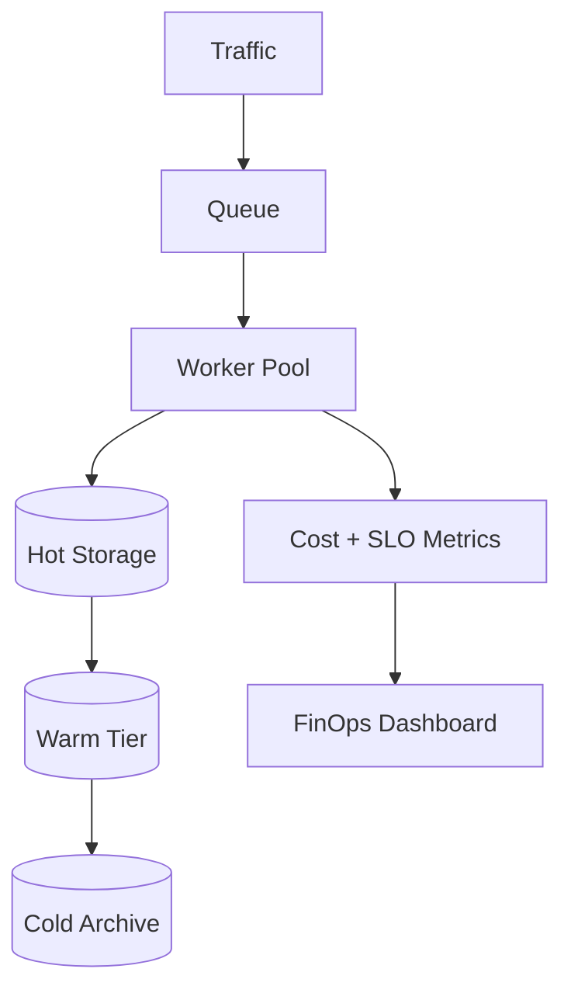

A system can be fast and reliable but still economically broken. FinOps-aware design treats cost as a first-class engineering constraint.

## 1) Problem Statement
Typical symptoms:
- Cloud spend grows faster than product growth
- No visibility into cost per service/customer
- Overprovisioned compute and storage
- Unpredictable monthly bills

## 2) Requirements
### Functional
- Cost attribution per service/team/customer
- Intelligent autoscaling strategy
- Storage lifecycle and tiering
- Cost anomaly detection

### Non-functional
- Lower cost per request over time
- No SLO regression
- Predictable budget trajectory
- Strong observability for spend drivers

## 3) Proposed Architecture

## 4) Core Strategies
- **Unit economics**: measure cost per request and per customer.
- **Queue-based smoothing**: absorb bursts and stabilize compute usage.
- **Autoscaling by workload**: scale on queue depth/business throughput, not CPU alone.
- **Storage lifecycle**: move old data to cheaper tiers automatically.

## 5) Trade-offs
- Aggressive optimization can increase latency if done blindly.
- Spot/preemptible capacity saves cost but needs retry-safe workloads.
- Deep archival saves storage but increases retrieval latency.

## 6) Failure Scenarios
- Cost spike from retry storms or runaway jobs
- Premature downsizing causing performance regressions
- Missing cost attribution due to poor tagging discipline

## 7) Production Checklist
- [ ] Standardized tagging across all resources
- [ ] Cost-per-request dashboards in place
- [ ] Autoscaling policies based on workload metrics
- [ ] Lifecycle policies for object/data stores
- [ ] Alerting for spend anomalies and budget breaches

## Conclusion
FinOps-aware architecture is not about cutting cost at all costs. It is about maximizing value per dollar while preserving reliability and performance.
