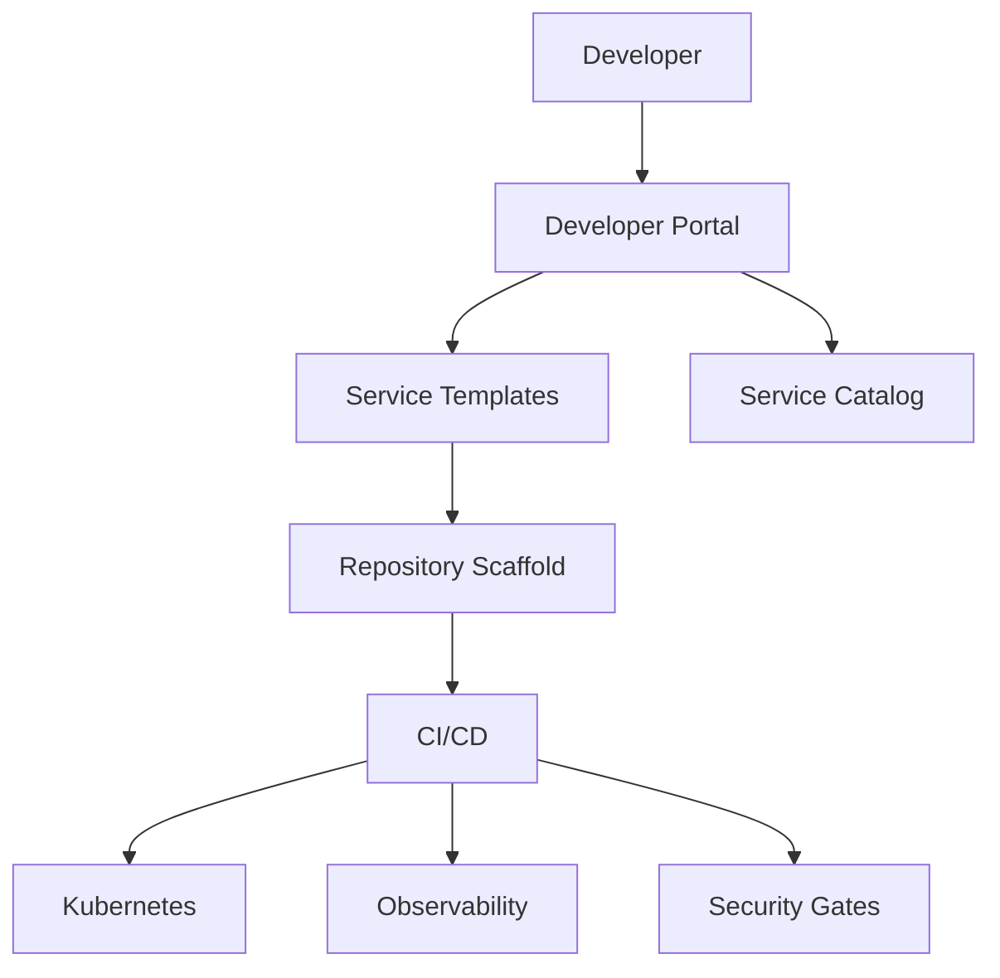

As engineering organizations scale, teams cannot keep reinventing CI/CD, infra, security, and observability. An IDP provides a self-service golden path.

## 1) Problem Statement
Without a platform:
- Onboarding is slow
- Standards are inconsistent
- Security/compliance is hard to enforce
- Developer cognitive load becomes too high

## 2) Requirements
### Functional
- One-click service scaffolding
- Service catalog with ownership metadata
- Built-in CI/CD and security checks
- Standardized infra modules

### Non-functional
- New service bootstrap < 30 minutes
- Consistent deployment quality
- Governance by default
- High platform reliability

## 3) Proposed Architecture

## 4) Core Principles
- **Golden path first**: standard templates cover most use cases.
- **Self-service with guardrails**: fast delivery without bypassing policy.
- **Platform as product**: roadmap, adoption metrics, user feedback.
- **Composable modules**: reusable infra + app building blocks.

## 5) Typical Workflow
1. Developer chooses template
2. Platform scaffolds code, pipeline, infra config
3. Security and quality checks run automatically
4. Canary/blue-green deploy strategy executes

## 6) Trade-offs
- Higher upfront platform investment
- Lower long-term engineering friction
- Some flexibility sacrificed for consistency

## 7) Production Checklist
- [ ] Standard templates for main tech stacks
- [ ] CI/CD guardrails enforced org-wide
- [ ] Service ownership and on-call metadata required
- [ ] Cost and SLO visibility per team
- [ ] Escape hatches documented and governed

## Conclusion
A strong IDP turns platform capabilities into reusable products for engineers—accelerating delivery while improving reliability and security.
