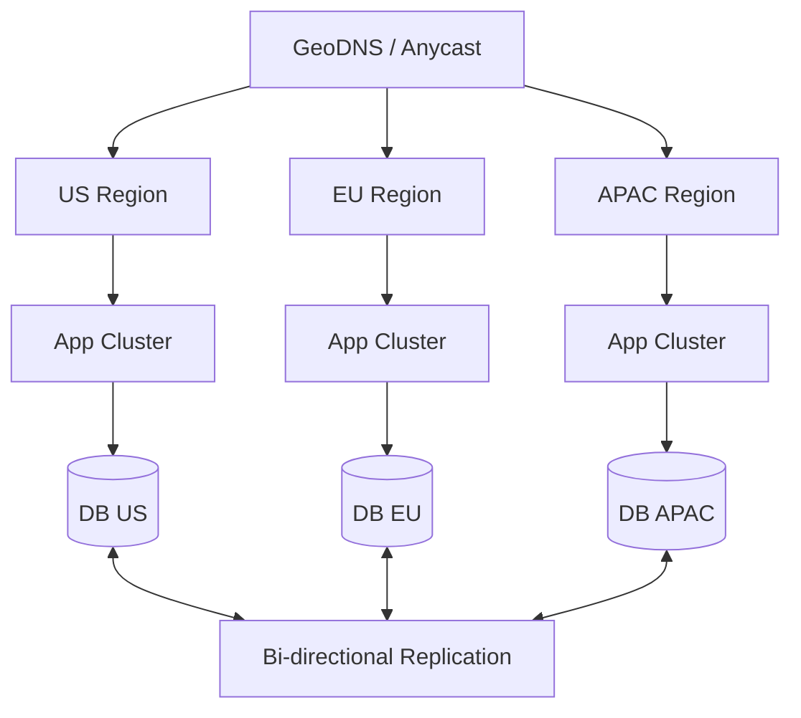

Global applications need low latency everywhere and resilience when a region fails. Active-active architecture can provide both, but it is significantly more complex than active-passive.

## 1) Problem Statement
Build a global system where:
- Users in US/EU/APAC get low latency
- Traffic automatically fails over when a region is down
- Data is replicated across regions
- Write conflicts are handled safely

## 2) Requirements
### Functional
- Local read/write when possible
- Automatic regional failover
- Cross-region replication
- Conflict resolution for concurrent updates

### Non-functional
- RPO < 1 minute
- RTO < 5 minutes
- P95 local latency < 100ms
- Replication lag < 5s

## 3) Proposed Architecture

## 4) Key Design Decisions
- **Traffic routing**: GeoDNS with health checks and low TTL.
- **Data model**: avoid auto-increment IDs; use ULID/Snowflake.
- **Replication mode**: async replication for lower latency, with clear consistency expectations.
- **Isolation**: each region should run independently to reduce blast radius.

## 5) Conflict Resolution
Common approaches:
- Last-write-wins (simple, but can lose intent)
- Version-based merge with business rules
- CRDT for specific collaborative data models

## 6) Failure Scenarios
- **Region outage**: route traffic to healthy regions.
- **Network partition**: continue region-local operations, reconcile later.
- **Replication lag spike**: expose stale-read risk and monitor aggressively.

## 7) Trade-offs
| Active-Active | Active-Passive |
|---|---|
| Better global latency | Simpler operations |
| Faster failover | Lower cost |
| More complex consistency/conflicts | Easier data model |

## 8) Production Checklist
- [ ] GeoDNS + health checks configured
- [ ] Cross-region replication monitored
- [ ] Conflict resolution policy documented
- [ ] Quarterly failover drills executed
- [ ] Region-level isolation validated

## Conclusion
Active-active is worth it for true global scale and high availability, but only when you are ready to invest in conflict handling, operational maturity, and DR discipline.
