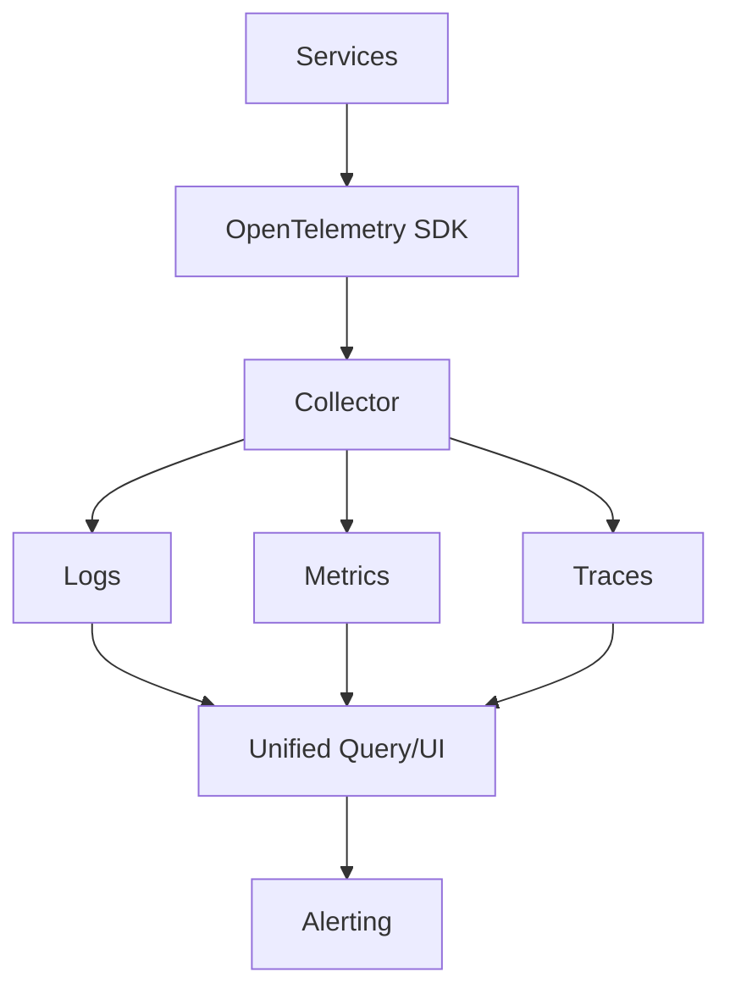

In distributed systems, poor observability turns every incident into guesswork. Observability-native architecture makes production behavior explainable.

## 1) Problem Statement
Common pain points:
- Alerts fire but root cause is unclear
- Logs exist but cannot be correlated
- Metrics show symptoms, not request-level causality
- MTTR is too high

## 2) Requirements
### Functional
- Unified logs, metrics, traces
- End-to-end trace context propagation
- SLO definitions and burn-rate tracking
- Alerting tied to user impact

### Non-functional
- Minimal runtime overhead
- Fast query and troubleshooting workflow
- Scalable telemetry ingestion and retention
- Sustainable telemetry cost

## 3) Proposed Architecture

## 4) Core Design Principles
- **Structured logs**: machine-queryable events.
- **Golden signals**: rate, errors, duration, saturation.
- **Trace-first debugging**: quickly isolate bottlenecks.
- **SLO-driven ops**: prioritize what impacts users.

## 5) Alerting Strategy
- Alert on SLO and burn rate, not raw noisy thresholds.
- Provide runbook links in every actionable alert.
- Separate page-worthy alerts from informational warnings.

## 6) Trade-offs
- Rich telemetry improves debugging but raises storage cost.
- High sampling reduces cost but may hide edge-case traces.
- Too many dashboards without ownership create alert fatigue.

## 7) Production Checklist
- [ ] Trace context propagated across all services
- [ ] Structured logging schema standardized
- [ ] Service-level SLOs defined and monitored
- [ ] Burn-rate alerts configured
- [ ] Telemetry retention/sampling policy documented

## Conclusion
Observability should be designed, not added later. Teams that invest early in traceability and SLO discipline recover faster and operate with far less production risk.
