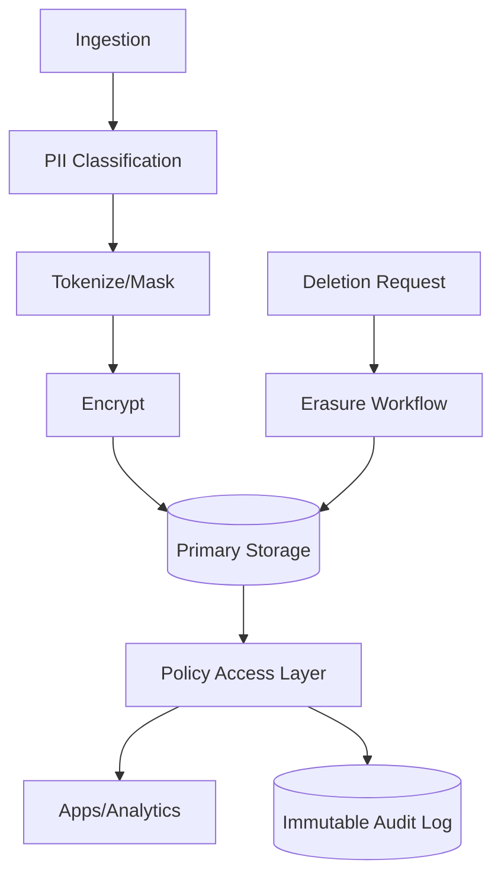

In modern AI/data products, privacy is both a legal and architectural concern. Privacy-first design protects users and reduces long-term compliance risk.

## 1) Problem Statement
We need a data architecture that:
- Protects sensitive and personal data by default
- Supports deletion and retention obligations
- Enables auditability of access and processing
- Still supports analytics and product features

## 2) Requirements
### Functional
- Data classification at ingestion
- Field-level protection (mask/tokenize/encrypt)
- Policy-based access controls
- Right-to-be-forgotten workflow
- Full audit trail

### Non-functional
- No plaintext sensitive data in logs
- Strong key management
- Deletion SLA guarantees
- Minimal impact on core query performance

## 3) Proposed Architecture

## 4) Core Principles
- **Classify early**: data policy starts at ingress.
- **Least privilege**: access is role and context aware.
- **Defense in depth**: tokenization + encryption + policy checks.
- **Prove compliance**: deletion and access actions are auditable.

## 5) Deletion Workflow Essentials
- Track deletion jobs by target systems (OLTP, warehouse, indexes, caches).
- Verify completion per target with status evidence.
- Enforce retention windows for backups where immediate deletion is impossible.

## 6) Trade-offs
- Stronger controls can increase operational complexity.
- Tokenization improves safety but adds lookup overhead.
- Strict policies reduce misuse but can slow ad-hoc analysis workflows.

## 7) Production Checklist
- [ ] Data classification taxonomy defined
- [ ] Sensitive fields protected by default
- [ ] Access policies versioned and enforced
- [ ] Deletion workflow tested end-to-end
- [ ] Immutable audit logs retained per policy

## Conclusion
Privacy-first architecture is not only about compliance. It creates safer systems, clearer governance, and stronger trust—especially for AI-enabled products.
