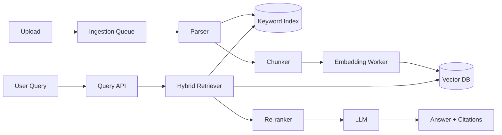

RAG (Retrieval-Augmented Generation) is the foundation of most enterprise AI applications. The biggest challenge isn't the demo—it's running it reliably for multiple tenants simultaneously.

## 1) Problem Statement
Build a "chat with your data" system for SaaS:
- Tenant A never sees Tenant B's data
- Newly uploaded data is searchable quickly
- Queries are accurate with citations
- Embedding + retrieval + generation costs are controlled

## 2) Requirements
### Functional
- Upload PDF/Doc/Markdown
- Parse + chunk + embedding
- Hybrid retrieval (keyword + vector)
- Re-rank before feeding to LLM
- Return answers with source citations

### Non-functional
- P95 query < 3s (except very large docs)
- Absolute tenant isolation
- Freshness < 5 minutes after upload
- High availability, retryable pipeline on failure

## 3) Proposed Architecture

## 4) Deep Dive
- **Semantic boundary chunking** (heading/section) is better than pure fixed-size chunks.
- **Hybrid retrieval** reduces false negatives for specific keywords.
- **Metadata filtering**: `tenant_id`, `project_id`, `doc_acl` are mandatory.
- **Citation enforcement**: answers must map back to chunk_id.

## 5) Trade-offs
- Small chunks: high recall, fragmented context.
- Large chunks: better context, lower recall.
- Good re-ranking: higher quality, but increases latency/cost.

## 6) Failure Handling
- Embedding job fails: send to DLQ + limited retry.
- Vector DB slow: fallback to keyword-first.
- Index drift when changing embedding model: version index by `embedding_model_version`.

## 7) Production Checklist
- [ ] Namespace by tenant in index
- [ ] ACL filter at retrieval layer
- [ ] Queue + DLQ for ingestion
- [ ] Re-index strategy when changing embedding model
- [ ] Dashboard: hit rate, latency, cost/query

## Conclusion
RAG at scale succeeds when balancing four things: **quality, isolation, freshness, cost**. Don't run vector-only; hybrid + re-rank is nearly the default in production.
