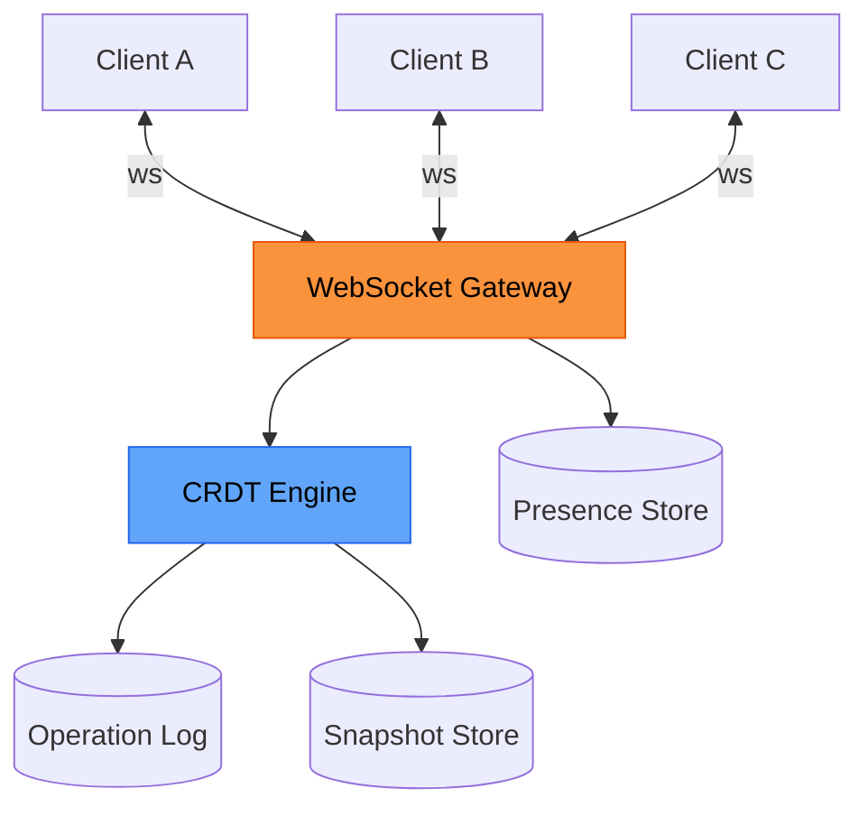
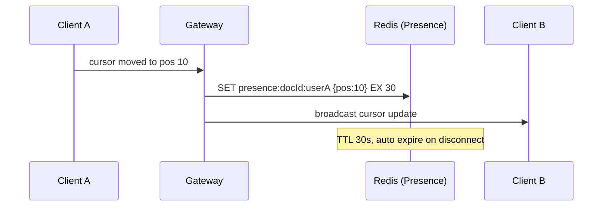
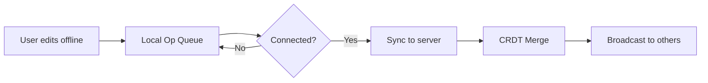
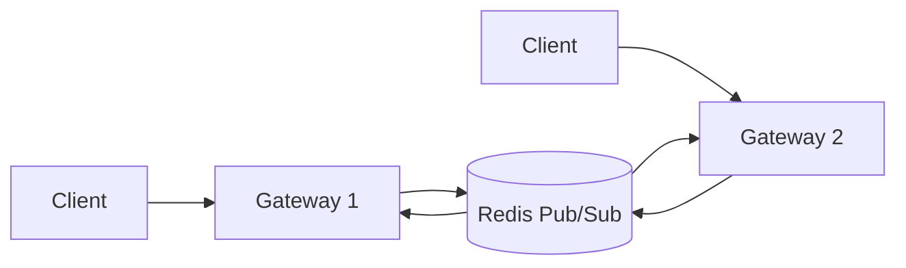

Real-time collaboration is a hard problem: multiple people editing simultaneously, working offline, automatic merge without data loss.

## 1) Problem Statement
Build a system that allows:
- Multiple users editing one document in real-time
- See others' cursors/selections
- Work offline, sync when back online
- Never lose data, conflicts auto-merge

**Examples**: Google Docs, Figma, Notion.

## 2) Requirements
### Functional
- Multi-user concurrent editing
- Presence (cursor, typing indicator)
- Offline-first: local ops queue
- Conflict-free merge
- History/undo

### Non-functional
- Latency < 100ms for local ops
- Network latency < 300ms for remote ops
- Scale to 50 concurrent editors/doc
- Snapshots to reduce replay log

## 3) Proposed Architecture


## 4) CRDT vs OT (Operational Transform)

| Aspect | CRDT | OT |
|--------|------|-----|
| Conflict resolution | Automatic, deterministic | Needs central server transform |
| Offline support | Good | Difficult |
| Complexity | High (complex data structures) | Medium |
| Examples | Yjs, Automerge | Google Docs (old) |

**2026 recommendation**: CRDT is more popular due to offline-first.

## 5) CRDT for Text Editing

**Basic problem**:
- User A inserts "X" at position 5
- User B deletes position 5
- How to merge?

**CRDT solution**: each character has unique ID, don't use pure index.

```typescript
interface CRDTChar {
  id: string;        // unique, immutable
  value: string;     // 'a', 'b', ...
  deleted: boolean;  // tombstone
  author: string;
  timestamp: number;
}
```

**Insert**: create new char with unique ID (Lamport timestamp or UUID).
**Delete**: mark `deleted = true` (don't actually delete).

Merge rule: sort by ID, skip deleted chars.

## 6) Presence (Ephemeral State)

Cursor/selection doesn't need long-term persistence.



**Key design**:
- Short TTL (30s), client heartbeat
- Broadcast via WebSocket, don't persist
- Throttle updates (max 10 updates/s)

## 7) Offline Sync



**Client-side**:
- Queue operations locally (IndexedDB)
- On reconnect: send all ops
- Server merges + broadcasts

**Conflict resolution**: CRDT auto-merges, no user intervention needed.

## 8) Snapshot & Compaction

**Problem**: operation log grows infinitely.

**Solution**: periodic snapshots.

```typescript
interface Snapshot {
  docId: string;
  version: number;      // op log version
  state: CRDTState;     // full document state
  createdAt: Date;
}
```

**Strategy**:
- Snapshot every 1000 ops or 1 hour
- New clients: load snapshot + replay ops after
- Delete ops older than snapshot

## 9) WebSocket Scaling

**Problem**: WebSocket is stateful, hard to scale horizontally.

**Solution 1: Sticky session**
- Load balancer routes by `doc_id` hash
- Simple but unbalanced if one doc is hot

**Solution 2: Pub/Sub backend**


Gateway subscribes to channel by `doc_id`, broadcasts to connected clients.

## 10) Failure Scenarios

### Client disconnects mid-session
- Presence auto-expires (TTL)
- Sent ops merge normally
- Unsent ops: queue locally, retry on reconnect

### Server crash
- Client reconnects to another server
- Load snapshot + ops from DB
- Continue editing

### Network partition
- Clients A, B offline simultaneously, edit differently
- On reconnect: CRDT merges both branches
- Deterministic merge (last-write-wins or more complex rules)

## 11) Performance Optimization

### Reduce op size
- Delta encoding: only send changes
- Batch ops: combine multiple keystrokes into one op

### Reduce broadcast storm
- Throttle presence updates
- Coalesce rapid ops (debounce 50ms)

### Lazy loading
- Only load visible portion of large docs
- Pagination for comments/threads

## 12) Trade-offs

| Approach | Pros | Cons |
|----------|------|------|
| CRDT | Good offline, auto-merge | Complex data structures, high overhead |
| OT | Simpler | Needs central server, offline difficult |
| Lock-based | Simplest | Poor UX (blocks users) |

## 13) Production Checklist

- [ ] **CRDT**
  - [ ] Choose library (Yjs, Automerge)
  - [ ] Snapshot strategy
  - [ ] Tombstone cleanup

- [ ] **WebSocket**
  - [ ] Sticky session or Pub/Sub
  - [ ] Heartbeat + reconnect logic
  - [ ] Rate limiting per connection

- [ ] **Presence**
  - [ ] TTL-based expiry
  - [ ] Throttle updates
  - [ ] Broadcast optimization

- [ ] **Persistence**
  - [ ] Op log storage
  - [ ] Snapshot storage
  - [ ] Backup strategy

- [ ] **Monitoring**
  - [ ] Active connections per doc
  - [ ] Op throughput
  - [ ] Merge conflicts (if any)
  - [ ] Latency P95

## 14) Interview Tips

**Q: CRDT vs OT, which to choose?**
A: CRDT if you need offline-first. OT if always online and want simpler implementation.

**Q: How to scale WebSocket?**
A: Pub/Sub backend (Redis) + stateless gateway. Clients can reconnect to different gateways.

**Q: How to handle conflicts when 2 people edit same spot?**
A: CRDT auto-merges using deterministic rules (timestamp, user ID). No user selection needed.

**Q: Document too large (1M chars), what to do?**
A: 
- Lazy load by viewport
- More frequent snapshots
- Pagination for comments
- Consider splitting document

## Conclusion

Real-time collaboration succeeds when:
- **CRDT** handles conflicts automatically
- **Snapshots** keep op log short
- **Presence** is ephemeral, TTL-based
- **WebSocket** scales via Pub/Sub
- **Offline** is first-class citizen, not afterthought

This is one of the hardest system design problems, but CRDT has made it much more feasible.
