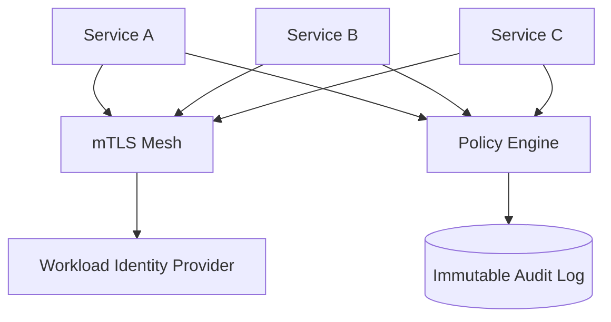

"Internal network = trusted" is outdated. Zero Trust assumes every request must be authenticated, authorized, and audited.

## 1) Problem Statement
For service-to-service communication, we need:
- Strong workload identity
- Encrypted traffic (mTLS)
- Fine-grained authorization
- Complete audit visibility

## 2) Requirements
### Functional
- Mutual authentication between services
- Policy-based authorization
- Secret access with least privilege
- Centralized audit logs

### Non-functional
- Minimal latency overhead
- Automatic cert rotation
- No downtime during policy updates
- Operable at large service counts

## 3) Proposed Architecture

## 4) Core Components
- **Workload identity** (SPIFFE/SPIRE style): identity bound to workload, not IP.
- **mTLS everywhere**: both client and server verify certificates.
- **Policy-as-code** (OPA): explicit allow/deny rules with versioning.
- **Short-lived credentials**: reduce blast radius from secret leakage.

## 5) Failure Handling
- CA outage: continue with cached valid certs, alert aggressively.
- Policy engine outage: prefer fail-closed for sensitive paths.
- Cert expiry risk: rotate early and monitor expiration windows.

## 6) Trade-offs
- Higher security and compliance readiness
- Increased operational and policy complexity
- Small latency overhead from authN/authZ checks

## 7) Production Checklist
- [ ] Service identity deployed and enforced
- [ ] mTLS required for all internal traffic
- [ ] OPA policies tested + versioned
- [ ] Secrets delivered dynamically (not static env vars)
- [ ] Audit logs immutable and queryable

## Conclusion
Zero Trust is not optional for modern distributed systems handling sensitive data. The complexity is real, but so is the security benefit.
