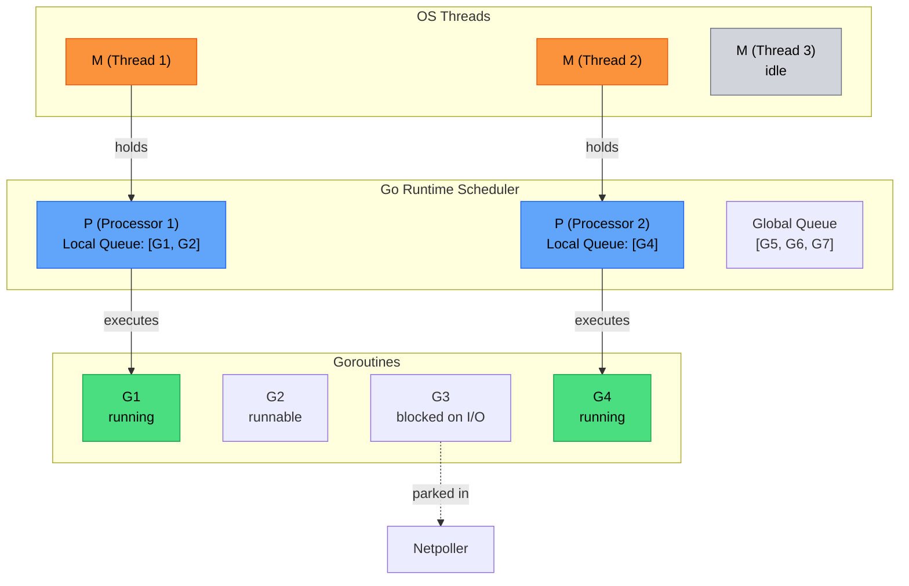
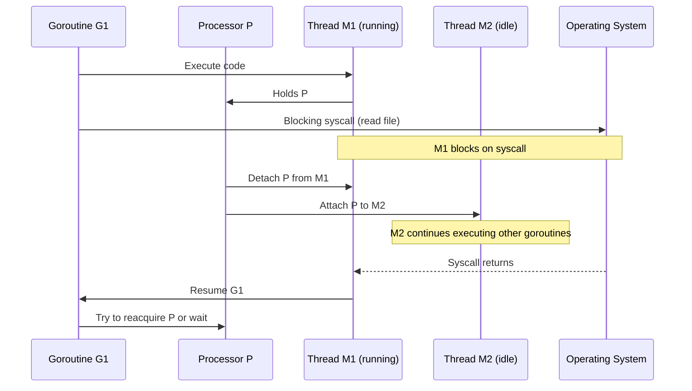
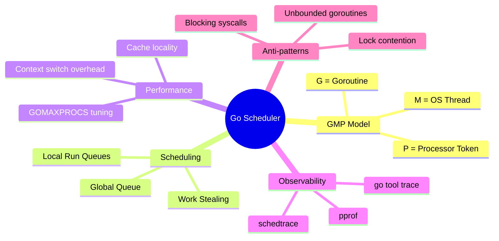

At small scale, Go's scheduler feels magical: you write goroutines, and things "just work." At scale, scheduler behavior directly impacts throughput, tail latency, and cost.

This article explains how the scheduler works internally and how senior engineers can tune systems based on real runtime behavior.

## Why scheduler knowledge matters

When your service has thousands of goroutines, performance issues often come from scheduling dynamics:

- runnable queue buildup
- poor `GOMAXPROCS` tuning
- blocking syscalls pinning threads
- lock contention and excessive context switching

Understanding scheduler internals turns blind tuning into systematic optimization.

## The GMP model



Go scheduler is built around three core abstractions:

- **G (Goroutine):** lightweight execution unit
- **M (Machine):** OS thread
- **P (Processor):** runtime resource required to execute Go code

### How they interact

- An `M` must hold a `P` to run Go code.
- A `P` has a local run queue of runnable goroutines.
- If local queue is empty, scheduler may steal work from another `P`.
- Network I/O readiness is integrated via netpoller.

Think of `P` as CPU scheduling tokens. Default number of `P` is `GOMAXPROCS`.

## Run queues and work stealing

```mermaid
flowchart LR
    subgraph P1["Processor P1"]
        LQ1["Local Queue<br/>[G1, G2, G3]"]
    end
    
    subgraph P2["Processor P2"]
        LQ2["Local Queue<br/>[] (empty)"]
    end
    
    GQ["Global Queue<br/>[G8, G9]"]
    
    LQ2 -->|1. Check local (empty)| WS["Work Stealing"]
    WS -->|2. Check global| GQ
    WS -->|3. Steal half from P1| LQ1
    LQ1 -->|stolen: G2,G3| LQ2
    
    style LQ1 fill:#93c5fd,stroke:#2563eb,color:#000
    style LQ2 fill:#fde68a,stroke:#d97706,color:#000
    style GQ fill:#c4b5fd,stroke:#7c3aed,color:#000
    style WS fill:#fca5a5,stroke:#dc2626,color:#000
```

Each `P` has a local queue for low-contention scheduling. There is also a global run queue for overflow and balancing.

Scheduling preference:

1. run from local queue
2. check global queue
3. steal from other `P` queues

Work stealing improves load balancing under uneven workloads, but frequent stealing can increase overhead.

## Preemption: from cooperative to asynchronous

Historically, Go relied heavily on cooperative preemption (goroutines yield at safe points like channel ops, syscalls, function calls).

Modern Go includes asynchronous preemption, allowing runtime to interrupt long-running goroutines more aggressively. This prevents one CPU-bound goroutine from starving others.

Still, preemption is not free:

- more preemption can mean more context switch overhead
- tight loops without function calls are less scheduler-friendly

### Yielding in hot loops

In rare compute-heavy loops, explicit yielding can help fairness:

```go
for i := 0; i < n; i++ {
    doCompute(i)
    if i%10000 == 0 {
        runtime.Gosched()
    }
}
```

Use cautiously: if you need this often, redesign workload partitioning.

## `GOMAXPROCS` tuning strategy

`GOMAXPROCS` controls number of `P`s, roughly max parallel Go execution.

Default is logical CPU count, usually good. But not always optimal.

### CPU-bound workloads

For pure CPU tasks, set near CPU core count:

- too low: underutilization
- too high: context-switch overhead

### I/O-heavy workloads

I/O waits release CPU, so higher goroutine count is fine, but `GOMAXPROCS` often still near core count.

Increasing `GOMAXPROCS` for I/O-heavy workloads may not improve throughput and can hurt cache locality.

### Practical benchmark loop

```go
func BenchmarkWithProcs(b *testing.B) {
    for _, p := range []int{1, 2, 4, 8, 16} {
        b.Run(fmt.Sprintf("procs=%d", p), func(b *testing.B) {
            prev := runtime.GOMAXPROCS(p)
            defer runtime.GOMAXPROCS(prev)

            b.ResetTimer()
            for i := 0; i < b.N; i++ {
                runWorkload()
            }
        })
    }
}
```

Pick based on throughput + p95/p99 latency, not throughput alone.

## Blocking syscalls and thread behavior



When a goroutine enters a blocking syscall, runtime may detach `P` from blocked `M` and attach it to another `M` so other goroutines can continue.

This preserves progress, but heavy syscall blocking can increase OS thread churn.

Key implication: goroutines are cheap, OS threads are not. Excessive blocking can still hurt system efficiency.

## Netpoller integration

Go runtime uses network poller (epoll/kqueue/IOCP depending on OS) to manage many network sockets efficiently.

When goroutine blocks on network I/O:

- it parks (not consuming CPU)
- runtime tracks readiness via netpoller
- when fd is ready, goroutine becomes runnable again

This is why Go handles high concurrent I/O with fewer threads than thread-per-connection models.

## Scheduler observability in practice

## 1) `GODEBUG=schedtrace`

Quick scheduler snapshots:

```bash
GODEBUG=schedtrace=1000,scheddetail=1 ./your-service
```

Prints scheduler state every second.

Look for:

- large run queues (runnable backlog)
- too many idle processors with pending work (imbalance)
- thread growth spikes

## 2) `go tool trace`

Capture runtime trace:

```bash
go test -run TestHotPath -trace trace.out ./...
go tool trace trace.out
```

Trace view helps inspect:

- goroutine lifecycle (runnable/running/blocked)
- syscall blocking windows
- GC pauses interacting with scheduling

## 3) pprof goroutine + CPU profiles

```bash
go tool pprof http://127.0.0.1:6060/debug/pprof/profile
go tool pprof http://127.0.0.1:6060/debug/pprof/goroutine
```

Correlate hot CPU stacks with goroutine states.

## Performance anti-patterns

## 1) Unbounded goroutine creation

```go
for _, req := range requests {
    go handle(req) // no bound
}
```

Use worker pools or semaphore limits.

## 2) Oversharded work causing contention

Too many tiny goroutines increase scheduling + synchronization overhead.

Batch work when granularity is too fine.

## 3) Lock-heavy critical sections

If many goroutines contend on mutexes, scheduler time is wasted on blocking/waking.

Strategies:

- reduce shared mutable state
- shard locks
- use message passing ownership model

## 4) Ignoring CPU cache locality

Frequent goroutine migration across cores can reduce cache efficiency. Sometimes fewer workers improve latency by reducing cross-core thrashing.

## Real-world tuning workflow

When optimizing a high-concurrency API service:

1. **Baseline**
   - throughput, p95/p99 latency, CPU, memory
2. **Observe scheduler**
   - schedtrace + trace + pprof
3. **Form hypothesis**
   - e.g. runnable backlog due to lock contention
4. **Apply one change**
   - adjust worker count, reduce lock scope, tune `GOMAXPROCS`
5. **Re-measure**
   - keep only improvements that survive repeated load tests

### Example scenario

- Symptom: p99 latency spikes at high QPS
- Observation: run queue grows, CPU near saturation
- Fix: reduced goroutine fan-out, introduced bounded worker pool, lowered lock contention
- Result: lower p99 and more stable throughput at same CPU budget

## Interaction with GC

Scheduler and GC are deeply connected:

- GC assist can slow allocating goroutines
- stop-the-world phases (short, but real) affect latency
- high allocation rates create extra scheduler pressure

Optimization often requires both:

- scheduler-aware concurrency design
- allocation reduction (`sync.Pool`, object reuse, batching)

## Key takeaways



- Go scheduler uses GMP model to multiplex many goroutines over limited threads.
- `GOMAXPROCS` is a tuning lever, not a magic throughput knob.
- Work stealing balances load but has overhead; avoid excessive runnable churn.
- Blocking syscalls and lock contention can dominate latency under load.
- Use `schedtrace`, `go tool trace`, and pprof together for root-cause analysis.
- Optimize with measurement loops, not intuition.
