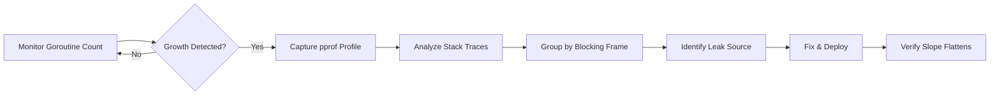

Goroutines are cheap, but not free. In real production systems, goroutine leaks are one of the most dangerous failure modes because they often look harmless at first, then slowly turn into memory pressure, scheduler contention, and eventually outages.

This article focuses on practical, senior-level patterns for finding and fixing leaks.

## What is a goroutine leak?

A goroutine leak happens when a goroutine is started but never exits, even though the work it was created for has already become irrelevant.

Common symptoms:

- `runtime.NumGoroutine()` grows continuously
- memory usage grows over time
- response latency increases under steady traffic
- shutdown hangs because background workers never return

## Why leaks are expensive

Leaked goroutines cause more than memory waste:

1. **Scheduler overhead**: more runnable/waiting goroutines means more scheduling work.
2. **Resource retention**: leaked goroutines can hold sockets, timers, channels, locks.
3. **Tail latency amplification**: blocked workers create queueing effects.
4. **Operational risk**: graceful shutdown and deploy rollouts become unreliable.

## Real-world leak patterns

```mermaid
graph TD
    subgraph Leak1["Pattern 1: Missing Cancellation"]
        H[HTTP Handler] -->|spawn| G1[Goroutine]
        G1 -->|blocks forever| API[Slow API Call]
        C[Client Disconnects] -.->|no signal| G1
    end
    
    subgraph Leak2["Pattern 2: Blocked Send"]
        P[Producer] -->|ch <- data| CH1[Channel]
        CH1 -.->|no consumer| BLOCK1[Blocked Forever]
    end
    
    subgraph Leak3["Pattern 3: Blocked Receive"]
        CH2[Channel] -->|<- ch| CON[Consumer]
        CON -.->|never closed| BLOCK2[Blocked Forever]
    end
    
    subgraph Leak4["Pattern 4: Forgotten Ticker"]
        T[Ticker] -->|tick| LOOP[for range ticker.C]
        LOOP -->|never stops| LEAK[Goroutine Leak]
    end
```



### 1) Missing cancellation in request-scoped work

```go
func handler(w http.ResponseWriter, r *http.Request) {
    go func() {
        // background call that may block forever
        _ = callSlowDependency()
    }()

    w.WriteHeader(http.StatusAccepted)
}
```

If the client disconnects or request times out, the goroutine still lives.

### 2) Goroutine blocked on send

```go
func producer(ch chan<- Event) {
    for {
        ev := readEvent()
        ch <- ev // blocks forever if no consumer
    }
}
```

### 3) Goroutine blocked on receive

```go
func consumer(ch <-chan Event) {
    for {
        ev := <-ch // blocks forever if channel never closed and no context
        process(ev)
    }
}
```

### 4) Forgotten ticker/timer loops

```go
func startMetricsLoop() {
    ticker := time.NewTicker(10 * time.Second)
    go func() {
        for range ticker.C {
            publishMetrics()
        }
    }()
    // ticker.Stop() never called -> loop never exits
}
```

## Detection strategy in production



### Step 1: Track goroutine count as a first-class SLI

Expose and alert on goroutine growth slope, not just absolute value.

```go
func observeRuntime() {
    g := runtime.NumGoroutine()
    runtimeGoroutinesGauge.Set(float64(g))
}
```

A healthy service can have a high count. A **steadily increasing baseline** is the red flag.

### Step 2: Capture goroutine profiles (`pprof`)

Enable pprof endpoint in internal admin network:

```go
import _ "net/http/pprof"

func startDebugServer() {
    go func() {
        _ = http.ListenAndServe("127.0.0.1:6060", nil)
    }()
}
```

Investigate:

```bash
go tool pprof http://127.0.0.1:6060/debug/pprof/goroutine
```

Or text dump with stacks:

```bash
curl -s http://127.0.0.1:6060/debug/pprof/goroutine?debug=2
```

Look for repeated stack signatures. If you see thousands of goroutines stuck at the same line, that line is likely your leak source.

### Step 3: Use `go tool trace` for lifecycle visibility

`trace` helps answer: are goroutines blocked on channel, syscall, network poller, or scheduler?

```bash
go test -run TestScenario -trace trace.out ./...
go tool trace trace.out
```

## Prevention patterns that scale

## 1) Context is mandatory for cancelable work

Any goroutine that can outlive request scope must accept a context.

```go
func fetchUser(ctx context.Context, id string) (User, error) {
    req, _ := http.NewRequestWithContext(ctx, "GET", "https://api.example.com/user/"+id, nil)
    resp, err := http.DefaultClient.Do(req)
    if err != nil {
        return User{}, err
    }
    defer resp.Body.Close()
    // decode...
    return User{}, nil
}
```

## 2) Always select on `ctx.Done()` in long-running loops

```go
func worker(ctx context.Context, jobs <-chan Job) {
    for {
        select {
        case <-ctx.Done():
            return
        case j, ok := <-jobs:
            if !ok {
                return
            }
            process(j)
        }
    }
}
```

## 3) Close ownership must be explicit

Define who closes channels. Ambiguous ownership creates zombie consumers.

## 4) Bound concurrency

Unbounded `go func(){...}` in hot paths is an outage pattern. Use semaphores or worker pools.

```go
sem := make(chan struct{}, 64) // max 64 concurrent tasks
for _, task := range tasks {
    sem <- struct{}{}
    go func(t Task) {
        defer func() { <-sem }()
        runTask(t)
    }(task)
}
```

## 5) Structured shutdown

Tie background tasks to a root context and waitgroup:

```go
type Runner struct {
    wg sync.WaitGroup
}

func (r *Runner) Go(ctx context.Context, fn func(context.Context)) {
    r.wg.Add(1)
    go func() {
        defer r.wg.Done()
        fn(ctx)
    }()
}

func (r *Runner) Wait() { r.wg.Wait() }
```

At shutdown: cancel root context, then wait with timeout budget.

## Leak debugging playbook

When you suspect a leak in production:

1. Compare goroutine count now vs 1h/24h baseline.
2. Capture multiple goroutine dumps over time.
3. Group stack traces by top blocking frame.
4. Identify missing cancellation/close path.
5. Patch and verify the slope flattens post-deploy.

## Code review checklist (senior teams)

Before merging concurrent code, ask:

- What terminates every goroutine created here?
- Is cancellation propagated from caller to callee?
- Could any channel send/receive block forever?
- Is concurrency bounded under burst traffic?
- Does graceful shutdown guarantee completion or cancellation?

## Key takeaways

- Goroutine leaks are a reliability issue, not only a memory issue.
- Track goroutine growth trend as an operational signal.
- Use `pprof` + stack grouping to find recurring blocked frames.
- Enforce context-driven cancellation and explicit channel ownership.
- Prefer structured concurrency patterns over ad-hoc goroutine spawning.
