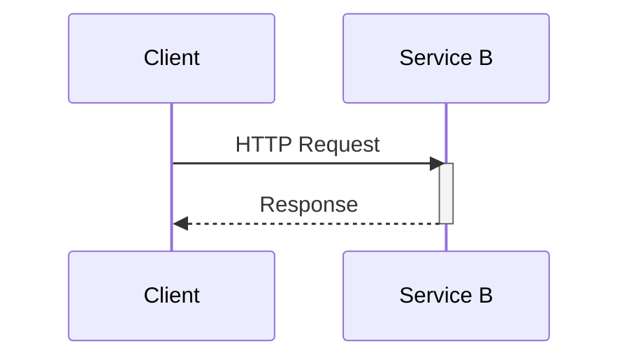
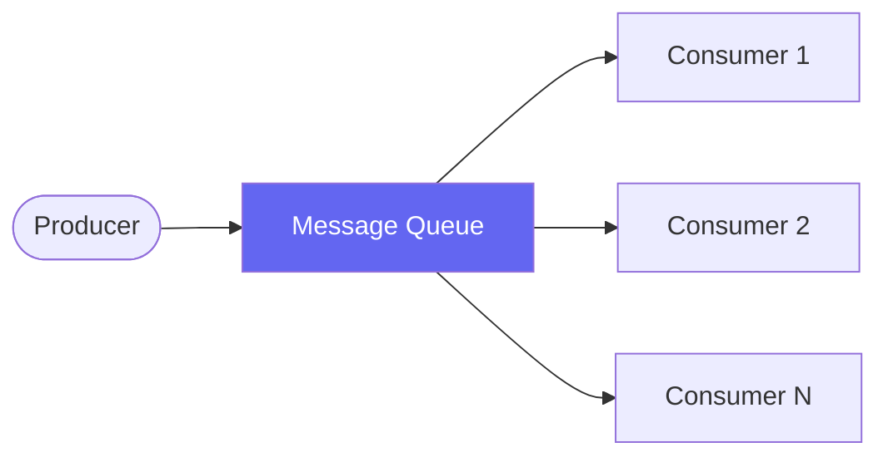
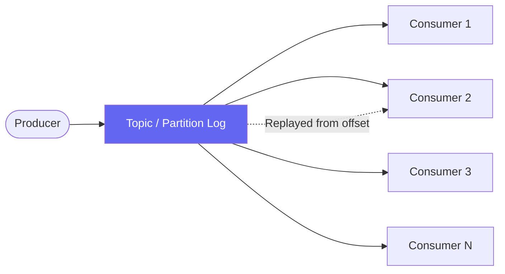

## The Three Communication Patterns

Every system at some point faces the same question: how should component A talk to component B? The answer usually comes down to one of three patterns — each with different trade-offs.

### 1. Direct Calls (Synchronous)

Component A calls component B directly, waiting for a response.

**When to use:**
- You need an immediate, reliable response
- The operation is fast (milliseconds, not seconds)
- Caller and callee are always available together
- You want simple error handling with try/catch

**Pros:**
- Simple — it's just a function call across the network
- Immediate consistency — you know the result right away
- Easy to debug and trace with a single request span
- No extra infrastructure to manage

**Cons:**
- Tight coupling — caller and callee must know about each other
- Caller is blocked while waiting (unless you make it async)
- Caller must handle failures from the callee
- All components must be healthy for the request to succeed
- Can create cascading failures under load

**Example tools:** REST, gRPC, GraphQL

---

### 2. Message Queues (Asynchronous)

A producer sends a message to a queue. Consumers pick up and process messages. Supports both point-to-point (one consumer per message) and pub/sub patterns (multiple consumers via exchanges/topics).

**When to use:**
- You want to decouple sender from receiver
- You need at-least-once delivery guarantees
- Receiver may be temporarily unavailable or slow
- You want to buffer burst traffic
- You need work to survive restarts of the consumer

**Pros:**
- Sender and receiver are fully decoupled
- Built-in retry and dead-letter handling
- Acts as a buffer during traffic spikes
- If a consumer crashes, unprocessed messages wait safely
- Easy to add multiple consumers (competing consumers pattern)

**Cons:**
- No guarantee of ordering across consumers
- No built-in replay — a consumed message is gone
- At-least-once, not exactly-once (without extra effort)
- Extra infrastructure to operate and monitor
- Harder to trace end-to-end flows

**Example tools:** RabbitMQ, AWS SQS, Redis Streams

---

### 3. Event Streams (Pub/Sub, Log-Based)

Messages are written to an append-only log. Multiple consumers read independently at their own pace. Messages can be replayed.

**When to use:**
- Multiple consumers need the same event
- You need ordering and durability guarantees
- You want replay capability (rewind and reprocess)
- You're dealing with high-throughput event sourcing
- You need a real-time view of what's happening

**Pros:**
- Many consumers can subscribe without the producer knowing
- Messages are retained and can be replayed from any offset
- Strong ordering guarantees within a partition
- Natural fit for event-driven architecture and CQRS
- Consumer lag is observable and alertable

**Cons:**
- Operational complexity is higher than queues
- Requires careful partition and key strategy
- Not a natural fit for request/response patterns
- Higher resource cost (disk retention)
- Consumers must track their own offset

**Example tools:** Apache Kafka, AWS Kinesis, Apache Pulsar

---

## Decision Framework

### The key questions to ask

**1. Does the caller need an immediate response?**

Yes → Direct call.  
No → Queue or stream.

**2. How many consumers need this message?**

Exactly one → Queue.  
Multiple → Stream.

**3. Do you need to replay events?**

Yes → Stream.  
No → Queue or direct call.

**4. What's the consequence if a message is lost or processed twice?**

Can tolerate loss → Direct call (fire-and-forget).  
Must not lose → Queue or stream.  
Must not duplicate → Direct call or stream with idempotency.

**5. What's the expected throughput?**

Low to medium, simple decoupling → Queue.  
High throughput, event sourcing → Stream.

**6. How coupled can the systems be?**

Tight coupling acceptable → Direct call.  
Need full decoupling → Queue or stream.

---

## Comparison Table

| Factor | Direct Calls | Message Queues | Event Streams |
|--------|-------------|----------------|---------------|
| Coupling | Tight | Decoupled | Fully decoupled |
| Response time | Immediate | Async | Async |
| Throughput | Medium | Medium–High | Very High |
| Ordering | Guaranteed | Per-consumer | Per-partition |
| Replay | No | No (usually) | Yes |
| Multiple consumers | No | Yes (competing) | Yes (independent) |
| Infrastructure | None | Moderate | High |
| Failure handling | Caller retries | Built-in retry | Consumer-controlled |
| Tracing | Easy | Medium | Medium–Hard |
| Example tools | REST, gRPC | SQS, RabbitMQ | Kafka, Kinesis |

---

## Common Patterns in Practice

### Direct calls for read paths
Fast, user-facing queries that need immediate data (e.g., "get my profile") almost always use direct calls. The latency budget doesn't allow for queuing overhead.

### Queues for background work
Any operation that doesn't need to happen immediately — sending emails, generating reports, processing uploads — is a great fit for a queue. The producer fires and forgets; the worker picks it up when ready.

### Streams for event-driven architecture
When you're building systems that need a real-time view of domain events (audit logs, financial transactions, user activity), streams let you materialize multiple read models and enable replay for debugging or schema migrations.

### Hybrids are common
Most real systems use all three. A synchronous API call might enqueue a background job. A stream consumer might call a direct API to enrich data. The pattern should match the coupling and latency needs of each specific interaction.

---

## Common Pitfalls

**Over-engineering with streams for simple decoupling.**  
If you just need background job processing and don't need replay or fan-out, a message queue is simpler and sufficient.

**Using direct calls for everything and building a distributed monolith.**  
If every service calls every other service synchronously, you have the deployment coupling of a monolith without any of the operational benefits. The system fails together too.

**Forgetting idempotency with queues.**  
At-least-once delivery means messages can be delivered twice. If your consumer isn't idempotent, you'll get duplicate processing.

**Not sizing consumer capacity.**  
A queue with a slow consumer becomes a backlog. Size your workers based on expected throughput and p99 processing time, not just average load.

**Ignoring queue depth monitoring.**  
A growing queue is an early warning sign. Set alerts on queue depth and consumer lag before it becomes an incident.

---

## Summary

| Need | Use |
|------|-----|
| Immediate response, single consumer | Direct call |
| Decoupled background work, at-least-once | Message Queue |
| Fan-out to many consumers, replay, high throughput | Event Stream |

The default should be **direct calls** for tightly coupled, user-facing flows. Reach for **queues** when you need reliability and decoupling for background work. Choose **streams** when you need multi-consumer fan-out, replay, or event sourcing at scale.

> The architecture should match the problem. A simple problem doesn't need a complex solution — but a complex problem will punish you for pretending it's simple.